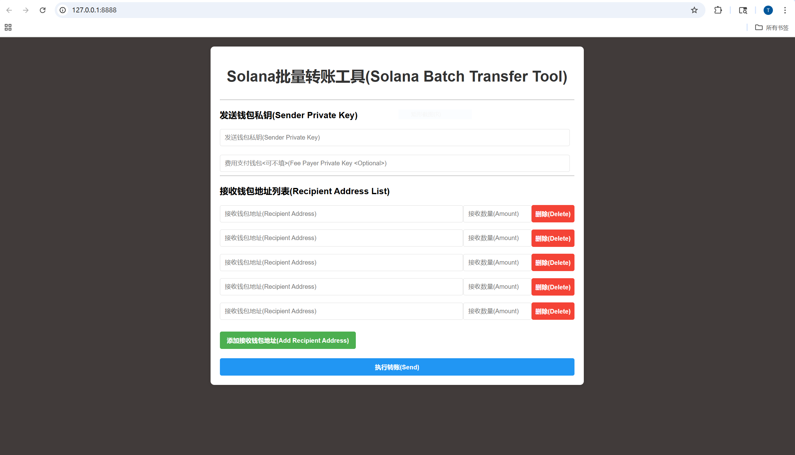

# solana_batch_transfer
solana批量转账(solana batch transfer)

### 1.功能介绍
批量转账

### 2.使用说明
解压可执行程序，双击运行

### 3.参数说明
1. 发送钱包私钥包含两个，一个是主发送钱包(必填项)，一个是费用支付钱包(非必填项)
2. 接收钱包包含两个参数，<钱包地址(必填项)> <转账数量(必填项)>

### 4.技术说明
1. 采用flask + js实现
2. 代码进行了加密